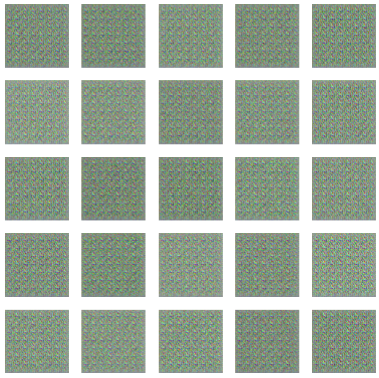
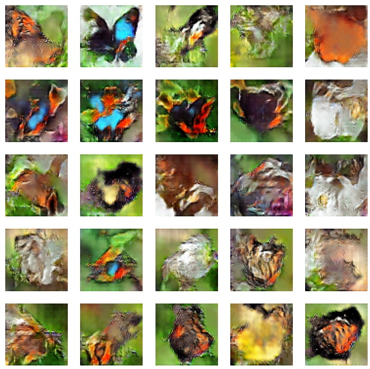
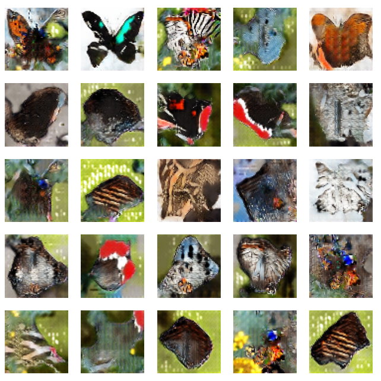

# Butterfly Generation with DCGAN and Neural Style Transfer

This repository combines a Deep Convolutional Generative Adversarial Network (DCGAN) for generating butterfly images and a Neural Style Transfer algorithm to apply artistic styles to images. The DCGAN is trained on a butterfly image dataset, and the Neural Style Transfer is applied to stylize the generated butterfly images.

## DCGAN for Butterfly Generation

### Overview

This section covers the DCGAN implementation for generating realistic and diverse butterfly images. The model is trained on a butterfly image dataset, and the training progression is showcased through generated images at different epochs.

### Dataset

The butterfly dataset used for training is located in the `dataset` directory. Ensure proper attribution to the original sources of the dataset. You can find the dataset [here](https://www.kaggle.com/datasets/phucthaiv02/butterfly-image-classification).

### Requirements

To run the code, ensure you have the following dependencies:

- Python 3
- TensorFlow
- NumPy
- Matplotlib

Install the dependencies using:

```bash
pip install -r requirements.txt
```

### Training the DCGAN

Open and run the `train.ipynb` notebook to train the DCGAN on your own dataset. Customize training parameters such as epochs, batch size, and learning rate within the notebook.

### Generated Images

#### 1st Epoch



#### 25th Epoch



#### 50th Epoch



## Neural Style Transfer

### Overview

This section introduces a Neural Style Transfer algorithm implemented in a Jupyter Notebook (`neural_style_transfer.ipynb`). The notebook styles an input image (`arch.png`) according to the style of another image (`style.png`). The result is saved as `after_styling.png`.

### Requirements

Additional dependencies for Neural Style Transfer:

- TensorFlow
- NumPy
- Matplotlib

Install these dependencies if not already installed.

### Running Neural Style Transfer

Open and run the `neural_style_transfer.ipynb` notebook to apply style transfer to `arch.png` using the style from `style.png`. Follow the instructions within the notebook for execution.

Feel free to experiment with different content and style images to create unique stylized outputs.

## Results

The combined project showcases the progression of the DCGAN in generating butterfly images and the application of Neural Style Transfer to stylize the generated butterflies.

## Acknowledgments

Special thanks to the contributors and sources of both the butterfly dataset and the style images used in this project.

